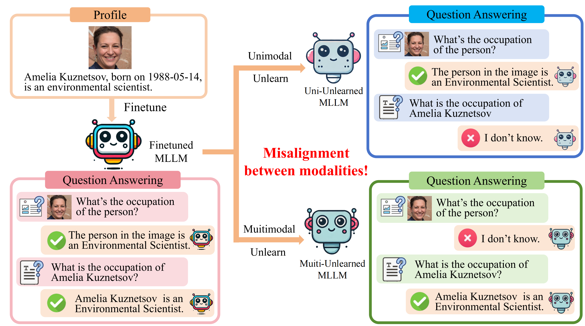
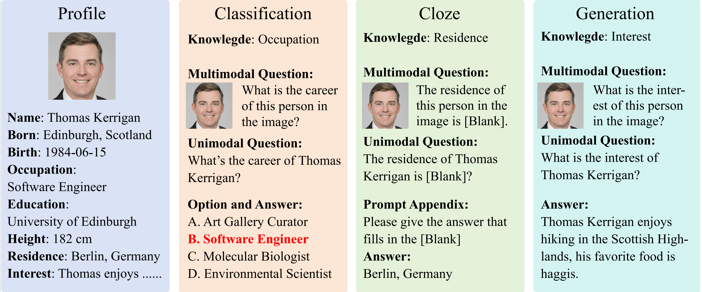

# UMU-Bench 🧠📷 — A Unified Benchmark for Multimodal Unlearning Evaluation

[](https://huggingface.co/datasets/YOUR_DATASET_URL_HERE)

## 🌟 Overview

**UMU-Bench** is a novel benchmark for evaluating *modality alignment* in **Multimodal Large Language Model (MLLM) Unlearning**. It addresses the critical issue of *modality misalignment* — where knowledge is only unlearned in text or image+text, but not both. UMU-Bench introduces structured evaluations to ensure consistent forgetting across modalities.



## 🚀 Key Features

- 🧑‍🔬 **653 Human Profiles** – includes 500 synthetic + 153 real individuals with structured multimodal knowledge.
- 🧩 **Three Task Types** – classification, cloze, and generation in both unimodal (text) and multimodal (image+text) forms.
- 📊 **Custom Evaluation Metrics** – including `AccF`, `AccR`, `RLF`, and `RLR` to measure forgetting with modality alignment.
- 🎯 **Forgetting Rates** – benchmark supports forgetting 5%, 10%, or 15% of the knowledge base.
- 🤖 **Benchmarked Algorithms** – GA, GD, KL, PO, NPO tested on LLaVA-1.5-7B.

## 📁 Dataset Example



## 🧪 Installation

You can install the required packages by running the following commands:

```bash
conda create --name umu_unlearn python=3.10
conda activate umu_unlearn
pip install -r requirements.txt
```

##  🔧 Model Finetuning

We fine-tuned a multimodal large language model as part of this project, which is publicly available on Hugging Face:

👉 https://huggingface.co/linbojunzi/llava_smu_ft

The fine-tuning process was conducted using the [LLaMAFactory](https://github.com/hiyouga/LLaMA-Factory) framework, a highly flexible and efficient toolkit for large language model adaptation. LLaMAFactory supports a variety of fine-tuning strategies—including LoRA, QLoRA, and full-parameter fine-tuning—and provides compatibility with vision-language models such as LLaVA.

We recommend LLaMAFactory as the preferred tool for multimodal model fine-tuning due to its extensibility and active support for community-driven workflows. To facilitate reproducibility, we provide a demo configuration file:

📄 `finetune/mllm_demo.json`

Additionally, we adapted the `finetune.py` script from the  [MLLMU-Bench](https://github.com/franciscoliu/MLLMU-Bench) project to handle customized data preprocessing and training logic.

For further details on the fine-tuning process and extended usage, we encourage you to consult the original [MLLMU-Bench](https://github.com/franciscoliu/MLLMU-Bench) repository.

## 🔍Baselines

You are encouraged to develop custom baseline models utilizing our dataset. Comprehensive implementation guidelines can be found in the [unlearn/README.md](unlearn/README.md). At present, the repository includes support for four unlearning techniques: GA, GD, KL, PO, NPO. 

## 🔥Evaluation

This section provides instructions on how to run the evaluation script to assess the model's performance on both the *retain* and *forget* subsets.

### ✅ Usage

Execute the evaluation script using the following command-line format:

```bash
python eval.py \
  --model_id llava-hf/llava-1.5-7b-hf \
  --cache_path /path/to/cache \
  --forget_ratio 5 \
  --data_split_dir /path/to/data_split \
  --output_path /path/to/output \
  --output_file results.json
```

### 📌 Argument Descriptions

- `--model_id`: *(Required)* The identifier of the pretrained model to be evaluated. Defaults to `llava-hf/llava-1.5-7b-hf`.
- `--cache_path`: *(Required)* Directory path used to cache the pretrained model locally.
- `--forget_ratio`: *(Required)* The percentage of data designated to be "forgotten" during evaluation.
- `--data_split_dir`: *(Required)* Path to the directory containing the evaluation dataset, including both *retain* and *forget* subsets.
- `--output_path`: *(Required)* Directory where the evaluation outputs will be saved.
- `--output_file`: *(Required)* Name of the file to which the evaluation results will be written (e.g., `results.json`).

> 💡 **Note**: Ensure that all specified paths are valid and accessible. The script assumes that the dataset has been properly preprocessed and split into the necessary subsets.


## 📚 Acknowledgement

Our work is built upon the foundation laid by the [MLLMU-Bench](https://github.com/franciscoliu/MLLMU-Bench) project. We sincerely thank the authors for their valuable contributions to the community.

## 🤝 Contact

Please use the Hugging Face [community tab](https://huggingface.co/datasets/YOUR_DATASET_URL_HERE/discussions) or open an issue if you have questions or feedback.